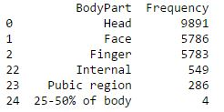
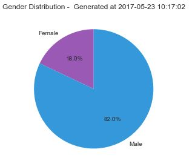
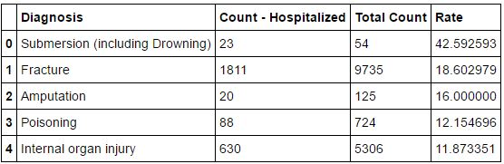
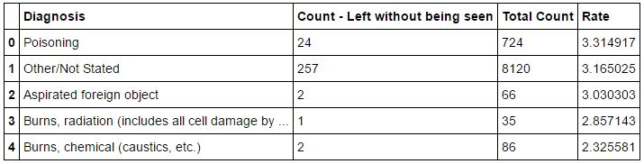

## NEISS Data Analysis

### Analysis 1

1. What are the top three body parts most frequently represented in this dataset?
2. What are the top three body parts that are least frequently represented?

### Results

### Analysis 2
1. How many injuries in this dataset involve a skateboard?
2. Of those injuries, what percentage were male and what percentage were female?
3. What was the average age of someone injured in an incident involving a skateboard?

### Results

## Analysis 3
1. What diagnosis had the highest hospitalization rate? 
2. What diagnosis most often concluded with the individual leaving without being seen?

### Conclusion
* People who drowned and with fractures are getting admitted since they are injuries that can't be self treated or cured instantly 
* I can conclude from this analysis that people  with poisoning and foreign objects are leaving without being seen since they felt the injury they have is not serious enough for admission and treatment or because they are not happy with the treatment (cost of treatment)suggested by the doctor.
* Even for small burns due to chemicals people believe it can be self cured and they do not need professional medical attention to it.

### Analysis 4

1. Relationship between age and reported injuries

### Conclusion
* From this analysis we can  infer that when people are young (infants,children) they tend to have injuries on the face (head and face injuries) which could be because they tend to fall while playing and hurt themselves.
* But for  adults, most of the injuries are in the arms and finger regions which could be because they tend to do a lot of work (household work, cooking etc.) during this age group. 
* As people tend to grow older, we again seem to notice more injuries on the head which might be because they grow older and fall often (due to weakness and lack of support)
* We can also observe that in this dataset, the maximum number of injuries are for the adults compared to other age groups

## Analysis 5
1. Where do the injuries occur(location) during different times of the year? 

### Conclusion
* We can conclude that maximum number of incidents occur during the start of summer and fall (May and September).
* The less number of injuries during November and december can be attributed to less people coming out of their homes during Winter (November and December)
* Maximum injuries in places of recreation or sports is during September (Fall). Taking precautions in such places can avoid such accidents.
* It can also be easily concluded that maximum incidents occur at home
